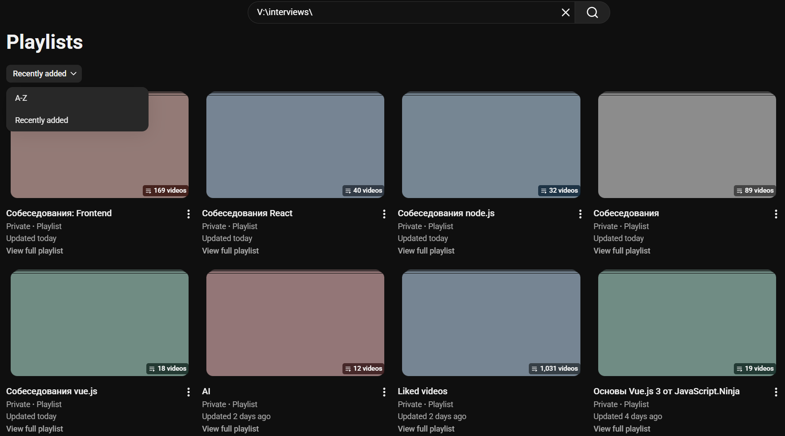
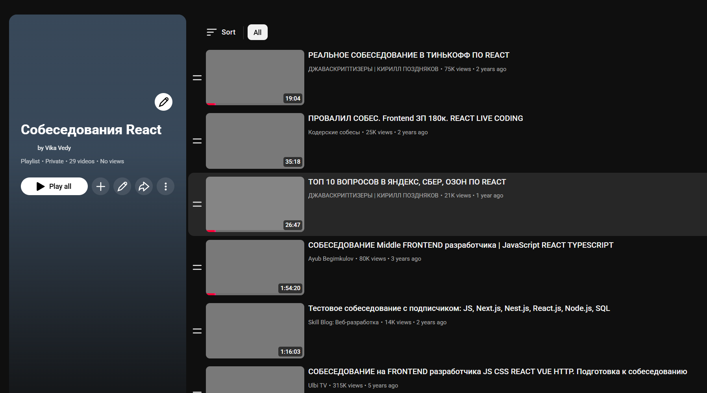
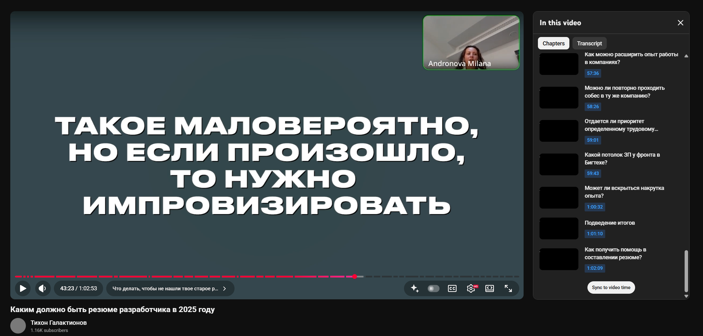
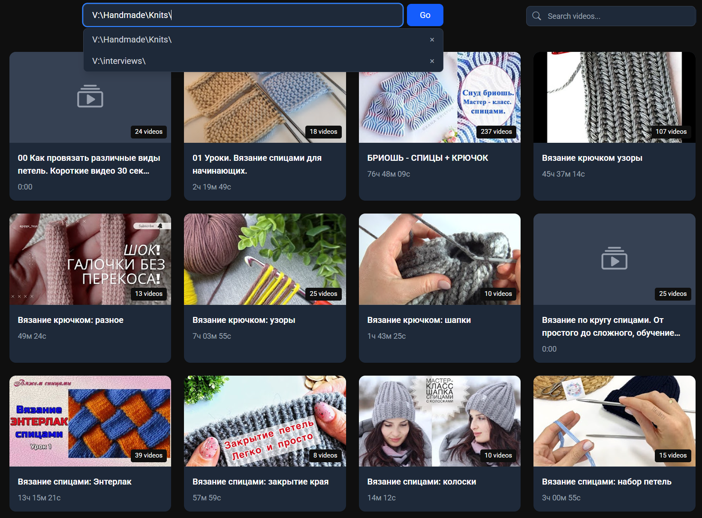

# Техническое задание

Это приложение — youtube clone для просмотра видеороликов, расположенных на компьютере  
Стек: vite + vue.js 3 + vue-router 4 + eslint + prettier + videojs (https://videojs.org/) + tailwindcss + express.js

---
## Содержание
- [Исходные данные](#исходные-данные)
- [Возможности приложения](#возможности-приложения)
    - [Главная страница](#главная-страница)
        - [Примерный вид главной страницы](#примерный-вид-главной-страницы)
    - [Страница плейлиста](#страница-плейлиста)
        - [Примерный вид страницы плейлиста](#примерный-вид-страницы-плейлиста)
    - [Страница просмотра видеоролика](#страница-просмотра-видеоролика)
        - [Примерный вид страницы просмотра видеоролика](#примерный-вид-страницы-просмотра-видеоролика)
- [Итоговый результат](#итоговый-результат)
- [Запуск и Сборка](#запуск-и-сборка)
    - [Предварительные требования](#предварительные-требования)
    - [Режим разработки (Development)](#режим-разработки-development)
    - [Запуск в режиме Electron (Dev)](#запуск-в-режиме-electron-dev)
    - [Сборка приложения (Production Build)](#сборка-приложения-production-build)

---
## Исходные данные
* Образец папки с плейлистами и видеороликами — @folder-sample.  
Предполагается, что плейлисты скачиваются в папку с помощью **yt-dlp** со следующими настройками:    
```
--js-runtimes node
--remote-components ejs:npm
--cookies "cookies.txt"
--embed-thumbnail
--write-thumbnail
--write-description
--add-metadata
--replace-in-metadata "playlist_title" "#" "hashtag_"
--replace-in-metadata "title" "#" "hashtag_"
-o "%(playlist_title)s/%(playlist_index)03d - %(title)s [%(id)s].%(ext)s"
--write-info-json
--write-playlist-metafiles
 --download-archive archive.txt 
 --no-overwrites
 --mtime
 ```

* Каждая папка с плейлистом содержит набор видео файлов, обложек, технических данных для каждого видео в формате json  
* В папках @frontend и @backend уже создан шаблон для реализации приложения  
* В папке @backend лежит server.ts — сторонний образец локального сервера для обработки запросов от frontend на парсинг папок на компьютере, его надо переделать в express.js-server и дополнить необходимым функционалом

## Возможности приложения
1. позволяет смотреть список плейлистов в выбранной папке на компьютере с возможностью сортировки либо по названию, либо по дате обновления,  
2. позволяет смотреть список видео в выбранном плейлисте, с возможностью сортировки либо по названию, либо по дате видеоролика,  
3. позволяет смотреть видеоролики как на youtube, with optional chapters list  

### Главная страница
1. Сверху поле для ввода пути с папкой плейлистов на компьютере, поле ввода должно хранить историю путей в виде кликабельного списка, который должен показываться во всплывающем под полем popup при фокусе на поле ввода  
2. Далее список самих плейлистов, выбранных по названию вложенных папок в указанной папке  
3. Для каждого плейлиста указаны: название, обложка, количество видеороликов, общее суммарное время всех видеороликов в плейлисте  
4. Клик по обложке активирует переход на страницу плейлиста  

#### Примерный вид главной страницы:



### Страница плейлиста
1. Сверху кнопка перехода назад на главную с выбранной папкой плейлистов  
2. Далее блок, разделённый на две части: слева обложка плейлиста, справа список видеороликов в плейлисте (пронумерованных в том порядке, в котором они приходят с backend-api), где есть обложка видеоролика, длительность, название, автор, дата  
3. При клике на элемент списка происходит переход на страницу просмотра видеоролика  
4. сверху над списком видеороликов должна находиться dropdown-кнопка с выбором способа сортировки, изначальная сортировка — как приходят с backend-api, также есть возможность сортировать по дате видео в прямом и обратном порядке, по названию видео в прямом и обратном порядке

#### Примерный вид страницы плейлиста:



### Страница просмотра видеоролика
1. Сверху кнопка перехода назад на страницу плейлиста (с названием плейлиста)  
2. Видеоплейер с возможностью открыть справа список chapters этого видеоролика  
3. Название видеоролика  
4. Автор  
5. если пользователь изменяет громкость видео, это должно запоминаться и все последующие видео должны запускаться с этой громкостью  


#### Примерный вид страницы просмотра видеоролика:


**References:**  
https://videojs.org/guides  
https://docs.videojs.com/chaptersbutton

## Итоговый результат


## Запуск и Сборка

### Предварительные требования
- Node.js (рекомендуется версия lts)
- Установленные зависимости в папках `local-video-viewer-ai-generated/backend` и `local-video-viewer-ai-generated/frontend`

```bash
# Установка зависимостей
cd frontend
npm install

cd ../backend
npm install
```

### Режим разработки (Development)

Для разработки рекомендуется запускать backend и frontend отдельно для работы Hot Module Replacement (HMR).

1. **Запуск Backend (API Server)**
   ```bash
   cd backend
   npm start
   # Сервер будет запущен на http://localhost:3000
   ```

2. **Запуск Frontend (Vite Dev Server)**
   ```bash
   cd frontend
   npm run dev
   # Приложение будет доступно по ссылке в терминале (обычно http://localhost:5173)
   ```

### Запуск в режиме Electron (Dev)

Если требуется проверить работу именно внутри Electron окна:

1. Соберите фронтенд (так как electron-main.js загружает статику или http://localhost:3000 который раздает статику в текущей конфигурации):
   ```bash
   cd frontend
   npm run build
   ```

2. Запустите Electron из папки backend:
   ```bash
   cd backend
   npm run electron:dev
   ```

### Сборка приложения (Production Build)

Чтобы создать установочный файл (exe/installer):

1. **Сборка Frontend**
   ```bash
   cd frontend
   npm run build
   ```
   Это создаст папку `dist` внутри `frontend`.  
   
   
2. **Сборка Backend и инсталлера**
   ```bash
   cd backend
   npm run dist
   ```
   Установочный файл появится в папке `dist`.

