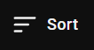
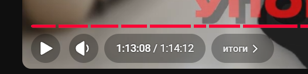
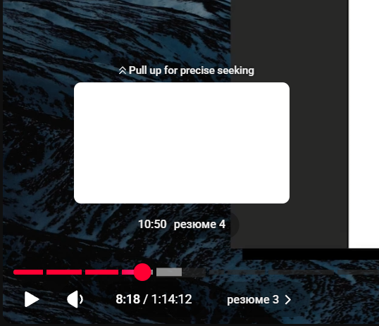

# New tasks

## I. Изучи проект и определись с его назначением и структурой
## II. составь план выполнения следующих задач:

### III. Страница плейлиста
1. кнопка-ссылка, ведущая назад на список плейлистов (на главную) должна быть зафиксирована вверху страницы и в тексте у неё должен быть путь на выбранную на главной папку с плейлистами
2. список видеороликов в плейлисте должен быть пронумерован в том порядке, в котором они приходят с backend-api
3. сверху над списком видеороликов должна находиться dropdown-кнопка с выбором способа сортировки, изначальная сортировка — как приходят с backend-api, также должна быть возможность сортировать по дате видео в прямом и обратном порядке, по названию видео в прямом и обратном порядке, по позиции в плейлисте в прямом и обратном порядке  
         

### IV.Страница просмотра видеоролика
1. Сверху кнопка перехода назад на страницу плейлиста должна иметь текст с названием плейлиста и должна быть зафиксирована и не прокручиваться вместе со страницей
2. Если пользователь изменяет громкость видео, это должно запоминаться и все последующие видео должны запускаться с этой громкостью  
3. при наведении курсора на видеоролик должны всплывать контролы: 
   слева: play/pause, volume, (текущая позиция в виде hh:mm:ss/полная длительность видео как hh:mm:ss), current chapter name (if video has chapters)
   справа: toggle fullscreen
4. controls sample:   
5. если в видео есть chapters, то они должны отображаться на progressbar (при наведении мышки на остановленное видео и при воспроизведении видео, то есть, progressbar должен делиться by chapters), как показано на скриншоте: 
