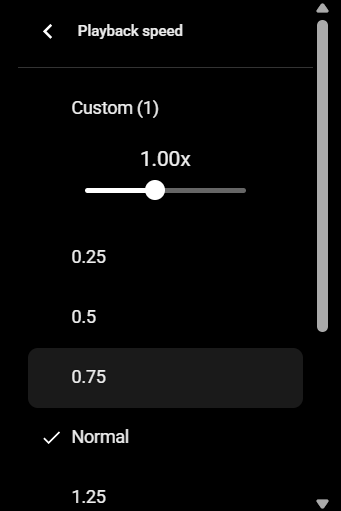

# New tasks

## I. Изучи проект и определись с его назначением и структурой
## II. составь план выполнения следующих задач:

### III. Страница просмотра видеоролика 
 при наведении курсора на видеоролик всплывают контролы (это уже реализовано): 
   слева: play/pause, volume, (текущая позиция в виде hh:mm:ss/полная длительность видео как hh:mm:ss), current chapter name (if video has chapters)
   справа: toggle fullscreen
!!!Надо добавить контрол с выбором скорости воспроизведения — кнопка, при нажатии на которую всплывает popup, где можно:
1. указать custom playback speed
2. выбрать из предложенных списком вариантов от 0.25 до 4 с шагом 0.25
Образец попапа: 
