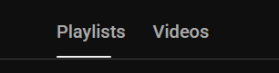

# New tasks

## I. Изучи проект и определись с его назначением и структурой
## II. составь план выполнения следующих задач:

### IV. Backend
Надо добавить api-эндпоинт для получения списка всех видео из выбранной папки (из всех сложенных плейлистов), отсортированные по дате их выхода (новые сначала)
### III. Frontend
1. Нужна кнопка «Домой» сверху слева с иконкой приложения на всех страницах, кроме главной
2. На главной странице надо добавить табы/вкладки для переключения отображения Плейлисты / Видео / Поиск :
  * на вкладке Плейлисты, как и сейчас, показывается список плейлистов
  * на вкладке Видео, надо показать вообще все видео из выбранной папки, отсортированные по дате их выхода
  * на вкладке Поиск, которая будет активироваться автоматически при прлиске из верхнего поля поиска, показываем результаты поиска
  Образец , как должны выглядеть табы/вкладки : 