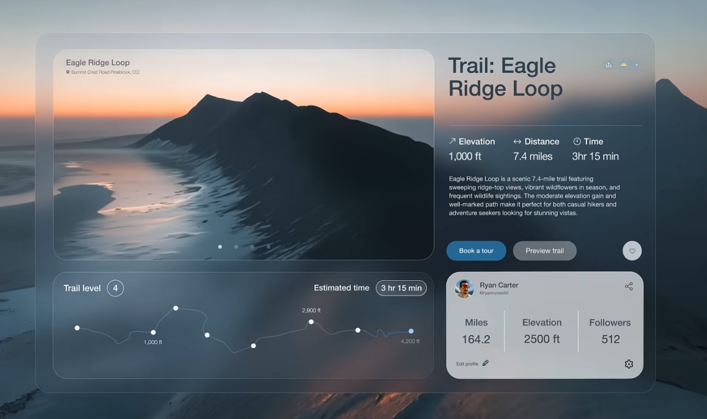

# Project To-Do List

## Backend Tasks
Nothing here
## Frontend Tasks
### у нас проблемы
1. в первом видео показано, как оно работало до правок:
   * удобные скроллбары, по которым легко попасть мышкой  и на достаточном расстоянии от карточек
   * страница реагирует на PageUp, PageDown,
   * удобное скрытие поля ввода директории и поля поиска, что расширяет область для просмотра карточек
   * удобно прикрепляются к верху страницы панель вкладок (сквозь неё красиво просвечивает контент) и заголовки групп
2. во втором видео — как оно сейчас, после правок:
   * мелкие скроллбары приклеены к карточкам, по скроллбару трудно попасть мышкой и легко промахнуться и попасть в карточку
   * страница больше не реагирует на PageUp, PageDown и не прокручивается
   * при прокрутке мышкой заголовки остаются на месте, а не уходят вверх страницы (панель ввода адреса и поиска не скрывается)
   * при группировке появляются двойные скроллбары, и вообще непонятно как прокручивать, чтобы посмотреть все карточки в группе
   * если карточек в группе мало, то остаётся много свободного места

я бы оставила скроллбар общий скраю справа, нормальной ширины
страница должна реагировать на PageUp, PageDown Home, End на клавиатуре, как обычно
что делать с группами и прокруткой в них и с их высотой — непонятно, но желательно, чтобы этой дополнительной прокрутки не было вообще, как и пустого места

### Cards glass effect 

